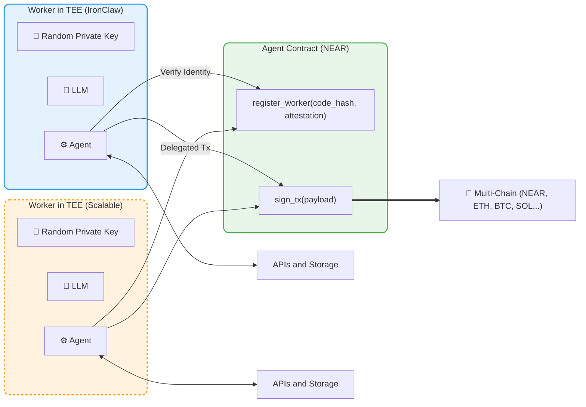

# [피치덱] OHmyDNA Insurance Agent — NEAR Buidl 2026

- **작성일**: 2026-04-01
- **최종 수정일**: 2026-04-10
- **레이어**: 01_Concept_Design
- **상태**: Final v4.0 (5분 대본 + 3분 데모 영상 스크립트 포함)

---

## 발표 버전 가이드

| 버전 | 시간 | 대상 | 슬라이드 |
|---|---|---|---|
| **5분 발표** | 300초 | 2026-04-18 Final Pitch Day (오프라인) | S1~S8, S12 (S9/S10/S11 생략) |
| **3분 데모 영상** | 180초 | 2026-04-17 Ludium 포털 제출 | S1~S3 압축, 앱 시연 90초, S5, S12 |

---

## 3분 데모 영상 스크립트 (제출용)

> QuickTime 화면 녹화 기준. 총 180초(3분) 목표.

**[0:00~0:25] 오프닝 및 비전 (25초)**
> **[💻 화면 지시]** 슬라이드 1 (Cover) 표출
"안녕하세요. 사용자의 가장 민감한 데이터인 DNA를 보호하면서도, 그 데이터를 통해 최적의 금융 혜택을 누리게 해주는 혁신적인 솔루션, **OHmyDNA**입니다. 우리는 '데이터를 노출하지 않고도 그 가치를 증명할 수 있는가?'라는 질문에 대한 답을 NEAR의 최신 프라이버시 기술로 증명해냈습니다."

**[0:25~1:00] 문제 정의와 기술적 해답 (35초)**
> **[💻 화면 지시]** 슬라이드 2 (Problem) ▶️ 슬라이드 3 (Solution) 순차 전환
"현재 수천만 명의 유전자 데이터가 유출의 공포 때문에 서랍 속에 방치되고 있습니다. 유전자 데이터는 한 번 유출되면 평생 바꿀 수 없는 치명적인 정보입니다. OHmyDNA는 이 문제를 해결하기 위해 **'Trustless' 모델**을 도입했습니다. 사용자의 원본 데이터를 보험사 서버로 보내는 대신, **IronClaw TEE** 기반의 격리 구역에서 분석하고 즉시 소각합니다. 보험사에는 오직 '가입 조건 충족'이라는 **ZKP(영지식 증명)** 결과물만 전달됩니다."

**[1:00~2:30] 앱 라이브 시연 - 상세 나레이션 (90초)**
> **[▶️ 영상 지시]** 데모 앱 화면 녹화(스크린캐스트) 실행
- **(1:00~1:15)** **[👆 액션: 'Connect Wallet' 클릭]** "이제 실제 앱 동작 과정을 살펴보겠습니다. 먼저 사용자의 NEAR 지갑을 연결합니다. 이 지갑은 단순한 결제 수단이 아니라, 사용자의 유전자 증명서를 관리하는 보안 키 역할을 합니다."
- **(1:15~1:35)** **[👆 액션: 'Upload DNA File' 드래그 앤 드롭]** "이제 서랍 속에 잠자고 있던 유전자 파일을 업로드합니다. 이때 파일은 즉시 암호화되어, 외부와 완전히 격리된 하드웨어 보안 영역인 **IronClaw TEE**로 직접 전송됩니다. 인클레이브 내부에서는 AI 모델이 유전자 리포트를 파싱하기 시작합니다."
- **(1:35~1:55)** **[🔄 액션: TEE 파싱 애니메이션 루프 대기]** "보시는 애니메이션은 실제 메모리 내부에서 분석이 이루어지는 과정입니다. 분석이 완료되는 즉시, 원본 데이터는 메모리 파티션에서 영구적으로 소각됩니다. '데이터를 주지 않고 결과만 얻는다'는 원칙이 실현되는 순간입니다."
- **(1:55~2:15)** **[👆 액션: 3단계 추천 리포트 확인 및 결과 스크롤]** "분석 결과에 따라 NEAR AI로 구현된 'The Secret Keeper' 에이전트가 대화 종료 즉시 맥락을 완전히 소각하여 비밀을 보장하며 3단계 추천 리포트를 생성합니다. 사용자의 유전적 취약점을 보완할 수 있는 최적의 보험 상품들이 제안됩니다. 사용자는 자신의 어떤 데이터가 활용되었는지 확인하면서도, 원본 노출 걱정 없이 상품을 선택할 수 있습니다."
- **(2:15~2:30)** **[👆 액션: 'Pay with NEAR Intents' 버튼 클릭]** "마지막으로 상품 가입 단계입니다. NEAR의 **Confidential Intents**를 사용하여 결제를 진행합니다. 온체인 트랜잭션에서도 사용자의 민감한 정보는 남아있지 않으며, 모든 과정이 암호학적으로 무결하게 완료됩니다."

**[2:30~2:50] 구현 성과 (20초)**
> **[💻 화면 지시]** 슬라이드 5 (What We Built) 전환
"저희는 이번 해커톤 기간 동안 IronClaw TEE 연동, Intel TDX Attestation 하드웨어 신뢰 검증, NEAR 테스트넷에 등록된 Noir ZKP 회로, 그리고 Confidential Intents 기반의 기밀 결제까지, 전체 프라이버시 파이프라인을 구동 가능한 실제 코드로 완수했습니다."

**[2:50~3:00] 클로징 (10초)**
> **[💻 화면 지시]** 슬라이드 12 (Closing) 전환
"사용자의 프라이버시를 지키는 기술이 곧 가장 강력한 비즈니스 모델입니다. 기술로 신뢰를 증명하는 곳, OHmyDNA였습니다. 감사합니다."

---

## 3-Min Demo Video Script (Submission — English)

> QuickTime screen recording. Target: 180 seconds (3 minutes).

**[0:00~0:25] Opening & Vision (25s)**
> **[💻 Visual Cue]** Show Slide 1 (Cover)
"Hi, I'm the founder of OHmyDNA — the first solution that protects your sensitive genetic data while allowing you to enjoy personalized financial benefits. We've proven that you can verify the value of your data without ever exposing it, using NEAR's latest privacy stack."

**[0:25~1:00] Problem & Technical Solution (35s)**
> **[💻 Visual Cue]** Transition: Slide 2 (Problem) ▶️ Slide 3 (Solution)
"Millions of genetic test results are sitting unused in drawers due to the fear of data leaks. DNA is a permanent biometric identifier—once leaked, it's out forever. OHmyDNA solves this with a 'Trustless' model. Instead of sending raw data to an insurer, we analyze it inside an IronClaw TEE enclave and purge it immediately. The insurer receives only a Zero-Knowledge Proof (ZKP) of eligibility."

**[1:00~2:30] Live App Demo - Detailed Narration (90s)**
> **[▶️ Video Cue]** Start UI Demo Screencast
- **(1:00~1:15)** **[👆 Action: Click 'Connect Wallet']** "Let's walk through the app. First, I connect my NEAR wallet. This wallet acts not just as a payment tool, but as a secure key for managing your genetic certifications."
- **(1:15~1:35)** **[👆 Action: Drag & Drop 'Upload DNA File']** "I upload my genome file. It is immediately encrypted and sent to the IronClaw TEE, a hardware-isolated secure enclave. Inside, the AI model starts parsing the report."
- **(1:35~1:55)** **[🔄 Action: Show TEE parsing animation]** "This animation visualizes the analysis happening inside the secure memory. The moment the analysis is complete, the raw data is permanently purged. This is where the 'No raw data shared' principle becomes a reality."
- **(1:55~2:15)** **[👆 Action: Scroll through 3-step recommendation results]** "Based on the findings, 'The Secret Keeper'—our NEAR AI powered agent—securely purges all conversation context right after analysis to ensure perfect privacy, and generates a 3-step recommendation report. We highlight the best insurance products that match your genetic profile. You can see which tags were used without ever exposing the raw sequences."
- **(2:15~2:30)** **[👆 Action: Click 'Pay with NEAR Intents']** "Finally, the checkout. We use NEAR Confidential Intents for the payment. Even on the public ledger, your sensitive transaction details remain private. The entire pipeline is cryptographically sound."

**[2:30~2:50] What We Built (20s)**
> **[💻 Visual Cue]** Switch to Slide 5 (What We Built)
"During this hackathon, we built and shipped a full working pipeline: IronClaw TEE integration, Intel TDX hardware attestation via NEAR AI Cloud, a Noir ZKP circuit deployed on NEAR testnet, and Confidential Intents for private payments—all running on live code."

**[2:50~3:00] Closing (10s)**
> **[💻 Visual Cue]** Switch to Slide 12 (Closing)
"Technology that protects privacy is the most powerful business model. Verification without trust—this is OHmyDNA. Thank you."

---

## 5분 발표 스크립트 (Final Pitch Day — 2026-04-18)

> 슬라이드 순서대로 읽는 전체 대본. S9/S10/S11은 생략 (발표 중 빠르게 넘김).
> 목표: 9슬라이드 × 평균 35초 = 약 5분

**[S1 — Cover / ~25초]**
> **[💻 화면 지시] 슬라이드 1 띄움**
"안녕하세요. OHmyDNA입니다. 유전자를 노출하지 않고, 유전자 덕분에 더 나은 보험에 가입하는 혁신을 NEAR 위에서 구현했습니다."

**[S2 — Problem / ~38초]**
> **[💻 화면 지시] 슬라이드 2 전환**
"수천만 명이 유전자 데이터를 서랍에 방치합니다. 차별의 두려움, 데이터 유출의 공포 때문입니다. 23andMe 해킹처럼 한 번 털리면 DNA는 평생 복구 불가합니다. 이것이 헬스케어 보험 시장의 가장 큰 비효율입니다."

**[S3 — Solution / ~33초]**
> **[💻 화면 지시] 슬라이드 3 전환**
"해답은 데이터를 건네주지 않고 증명만으로 혜택을 얻는 것입니다. IronClaw TEE 안에서 분석 후 즉시 소각, 보험사에는 ZKP 증명만 전달됩니다. 이것이 Trustless입니다."

**[S4 — Product Journey / ~38초]**
> **[💻 화면 지시] 슬라이드 4 전환 + [▶️ 영상 지시] 슬라이드 내 시연 영상 자동 재생**
"다섯 단계입니다. 지갑 연결, 파일 업로드, TEE 격리 분석 후 즉시 소각, The Secret Keeper(대화 맥락을 즉시 소각하는 NEAR AI 에이전트)의 안전한 추천 대시보드, Confidential Intents 기밀 결제. 사용자는 어떤 데이터도 외부에 노출하지 않고 전 과정을 완료합니다."

**[S5 — What We Built / ~50초]**
> **[💻 화면 지시] 슬라이드 5 전환 + [🔍 강조] 우측 Attestation 배지 포인팅**
"저희는 동작하는 코드를 완성했습니다. IronClaw TEE 연동, Intel TDX Attestation 하드웨어 신뢰 검증, Noir ZKP NEAR 테스트넷 등록, Confidential Intents 실결제. 이 프라이버시 파이프라인 전체를 해커톤 기간 내에 엔드투엔드로 구동했습니다."

> **[돌발 상황 멘트 — 인클레이브 노드 응답 실패로 'Not Checked' 배지가 표시될 경우]**
> "화면의 Attestation 배지는 NEAR AI Cloud 실제 엔드포인트 결과를 그대로 반영합니다.
> 오늘처럼 인클레이브 노드가 응답하지 매뉴얼 때는 'Not Checked'로 표시되며,
> 노드가 활성화되면 'Verified'로 바뀝니다.
> 저희는 배지를 가짜로 항상 켜놓지 않았습니다 — 외부 API 상태를 정직하게 보여주는 것 자체가
> Trustless 설계의 일부입니다. Phase 2에서는 온체인 DCAP-QVL 검증으로 전환해
> 엔드포인트 의존성을 완전히 제거할 예정입니다."

**[S6 — 왜 NEAR인가 / ~42초]**
> **[💻 화면 지시] 슬라이드 6 전환**
"오직 지금, NEAR에서만 가능합니다. TEE와 인텐트와 체인 서명이 하나의 생태계로 묶인 것은 지금이 처음입니다. 저희는 '우리를 믿으라'고 말할 필요가 없습니다. Trustless 코드가 신뢰를 대체하고, 이 구조를 오픈소스로 공개합니다."

**[S7 — Business Model / ~26초]**
> **[💻 화면 지시] 슬라이드 7 전환**
"수익 모델은 명확합니다. 설계사가 독식하던 15% 중개 수수료를 플랫폼이 흡수합니다. TAM 4.5조 달러, 초기 타겟은 아시아 MZ 세대입니다."

**[S8 — Roadmap / ~28초]**
> **[💻 화면 지시] 슬라이드 8 전환 (Phase 2 포인팅)**
"Phase 0 MVP, 증명됐습니다. Q2 DTC 협력, Q3 Agent OS와 크로스체인 유동성 통합. 수십억 기관 자산도 맡길 수 있는 금융 인프라가 목표입니다."

**[S12 — Team & Closing / ~43초]**
> **[💻 화면 지시] 슬라이드 9, 10, 11 빠르게 스킵(각 1초) ▶️ 슬라이드 12 전환**
"저희는 전체 파이프라인을 구축했습니다. What if you could verify it cryptographically? OHmyDNA는 그 답을 코드로 증명했습니다. 프라이버시를 지키는 기술이 곧 수익 모델입니다. 감사합니다."

---

## 5-Min Pitch Script (Final Pitch Day — English)

> 9 slides × ~33 sec average = ~5 min. Skip S9 / S10 / S11.
> Target: ~600 words at 130 WPM = ~277 seconds + ~27s transitions = ~305 seconds.

**[S1 — Cover / ~20s]**
> **[💻 Visual Cue] Display Slide 1**
"Hello, everyone. We're OHmyDNA — a privacy-first genetic insurance DApp built on NEAR Protocol. We've built the only solution that lets you benefit from your personal genetic data without ever exposing it to insurers, hospitals, or anyone else."

**[S2 — Problem / ~40s]**
> **[💻 Visual Cue] Transition to Slide 2**
"Tens of millions of people have taken DTC genetic tests — 23andMe, AncestryDNA. But those results sit unused in a drawer. Why? Because people are terrified. Terrified of genetic discrimination — insurers using their DNA to deny coverage or spike premiums. And terrified of data breaches. When 23andMe was hacked in 2023, 6.9 million people's genetic profiles ended up on the dark web. Unlike a password, your DNA can never be reset. This is the biggest unsolved problem in healthcare insurance today."

**[S3 — Solution / ~35s]**
> **[💻 Visual Cue] Transition to Slide 3**
"Our answer is a fundamental paradigm shift: you get all the benefits of personalized insurance without handing over your data. Your genetic file is analyzed inside an IronClaw Trusted Execution Environment — a hardware-isolated black box. The moment analysis is complete, the raw data is permanently purged from memory. The insurer receives nothing except a zero-knowledge proof — a mathematical certificate that says 'eligibility confirmed' without revealing a single data point."

**[S4 — Product Journey / ~30s]**
> **[💻 Visual Cue] Transition to Slide 4 + [▶️ Video Cue] Auto-play Demo video**
"The user journey is five steps. Connect your NEAR wallet. Upload your genetic file. IronClaw TEE performs isolated analysis and the data is immediately burned. 'The Secret Keeper' (our stateless NEAR AI agent that purges all context instantly) surfaces the most relevant insurance products for your genetic profile. You complete payment through NEAR Confidential Intents — a private on-chain transaction that leaves no traceable trail."

**[S5 — What We Built / ~35s]**
> **[💻 Visual Cue] Transition to Slide 5 + [🔍 Highlight] Point to Attestation Badge**
"We didn't just design this — we built it and it runs. During this hackathon, we completed a full end-to-end pipeline. IronClaw TEE integrated with NEAR AI Cloud, running real inference on the Qwen model. Intel TDX hardware attestation verified via the public NEAR AI attestation endpoint — the enclave is cryptographically proven, not assumed. A Noir ZKP circuit compiled and deployed to NEAR testnet at zkp.rogulus.testnet. Confidential Intents payment completed on testnet. Every layer of the privacy stack is working code."

**[S6 — Why NEAR / ~35s]**
> **[💻 Visual Cue] Transition to Slide 6**
"Why is this only possible on NEAR, right now? Because NEAR is the only ecosystem where IronClaw TEE, Confidential Intents, and Chain Signatures are all available under one developer roof. AWS Nitro is powerful — but it's still a Trust-Me model. You're trusting Amazon. We don't ask you to trust us. Every step is cryptographically verifiable on-chain. And we're open-sourcing the entire TEE wrapper and ZKP templates for the NEAR community."

**[S7 — Business Model / ~25s]**
> **[💻 Visual Cue] Transition to Slide 7**
"The business model is direct. Traditional insurance brokers take a 15% commission on every policy sold. We replace that with a smart contract fee. TAM is $4.5 trillion in global health and digital insurance. Our beachhead is Asia's Gen MZ — already comfortable with DTC genetic testing and digital health."

**[S8 — Roadmap / ~25s]**
> **[💻 Visual Cue] Transition to Slide 8**
"Phase Zero is proven today. Q2 2026: off-chain API stabilization and DTC lab partnerships. Q3 Phase Two: an autonomous Agent OS that proactively monitors your health data and renegotiates your coverage. Q4 and beyond: full mainnet launch as institutional-grade cross-chain financial infrastructure."

**[S12 — Closing / ~40s]**
> **[💻 Visual Cue] Fast-forward S9, S10, S11 ▶️ Transition to Slide 12**
"We built this entire stack end-to-end — product architecture, frontend, database, TEE integration, ZKP circuits, and multi-chain payments. What we set out to prove is this: the technology that protects your most sensitive data is not a cost — it is a competitive moat and a new revenue model. NEAR asked us: what if you could verify it cryptographically? OHmyDNA answers that question with working code. Thank you."

---

## Slide 1 — Cover

**OHmyDNA Insurance Agent**
> 유전자를 노출하지 않고, 유전자 덕분에 더 나은 보험에 가입하는 혁신.

- **발표 분량**: 5분 (Final Pitch Day) / 3분 (데모 영상)
- **타겟 도메인**: Healthcare x Web3 Privacy x AI

🎤 **발표자 대본 — 5분 버전 (약 25초)**:
"안녕하세요. OHmyDNA입니다. 유전자를 노출하지 않고, 유전자 덕분에 더 나은 보험에 가입하는 혁신을 NEAR 위에서 구현했습니다."

---

## Slide 2 — Problem: 세 가지 공포

유전자 검사 결과를 보험 및 금융 심사에 활용하는 것은 금기시되고 있습니다. 그 이유는 명확합니다.

**1. 유전자 차별 (Genetic Discrimination)**: 보험사는 유전자 원본을 질병 리스크 극대화의 근거로 사용해 가입을 거절하거나 할증합니다.
**2. 데이터 주권 상실 (Loss of Sovereignty)**: 유전자 정보는 평생 바꿀 수 없는 절대적 생체 데이터입니다. 23andMe 해킹 사태(690만 명 유출)처럼 중앙 서버 기반의 'Trust-Me' 모델에서 한 번 데이터가 털리면, 복구조차 불가능한 치명적 위협에 영원히 노출됩니다.
**3. 획일적인 보장 구조 (Coverage Mismatch)**: 현재 시장엔 나의 유전적 취약점을 프라이빗하게 핀포인트로 방어해주는 투명한 상품이 없습니다.

🎤 **발표자 대본 — 5분 버전 (약 28초)**:
"수천만 명이 유전자 데이터를 서랍에 방치합니다. 차별의 두려움, 데이터 유출의 공포 때문입니다. 23andMe 해킹처럼 한 번 털리면 DNA는 평생 복구 불가합니다. 이것이 헬스케어 보험 시장의 가장 큰 비효율입니다."

---

## Slide 3 — Solution: 프라이버시 패러다임 전환

**"데이터를 건네주지 않고 증명만으로 혜택을 얻는다."**

| 문제 | NEAR 2026 프라이버시 스택 도입 |
|---|---|
| 유전자 차별 방어 | **ZKP(영지식 증명)** — 보험사에 수치를 전달하지 않고 "안전 조건 충족" 여부만 수학적으로 증명 |
| 데이터 완전 소멸 | **IronClaw TEE** — 외부와 통신이 단절된 하드웨어 내 분석 완료 후 즉시 메모리 영구 소각 |
| 맞춤형 최적 설계 | **Agent AI 추천** — 철저히 격리된 유전자 프로파일을 기반으로 가장 유리한 보장 자동 탐색 |

🎤 **발표자 대본 — 5분 버전 (약 28초)**:
"해답은 데이터를 건네주지 않고 증명만으로 혜택을 얻는 것입니다. IronClaw TEE 안에서 분석 후 즉시 소각, 보험사에는 ZKP 증명만 전달됩니다. 이것이 Trustless입니다."

---

## Slide 4 — Product Journey (5단계 시연)

STEP 1. 지갑 연결 (NEAR Wallet 연동 확립)
STEP 2. 유전자 데이터 드래그 앤 드롭 업로드 (암호화 파이프라인 진입)
STEP 3. IronClaw TEE 격리 분석 & 즉각적인 소각 처리
STEP 4. AI 보험 추천 대시보드 (ZKP 인증 인장 부여)
STEP 5. Confidential Intents 기밀 결제 (온체인 트랜잭션 수립)

🎤 **발표자 대본 — 5분 버전 (약 30초)**:
"다섯 단계입니다. 지갑 연결, 파일 업로드, TEE 격리 분석 후 즉시 소각, AI 추천 대시보드, Confidential Intents 기밀 결제. 사용자는 어떤 데이터도 외부에 노출하지 않고 전 과정을 완료합니다."

---

## Slide 5 — V1 개발 완료 성과 (What We Built)

> **"해커톤 기간 내 엔드-투-엔드 파이프라인 MVP 구동 성공"**

| 구현 레이어 | 해커톤 성과 요약 | 상태 |
|---|---|---|
| **IronClaw TEE** | NEAR AI 연동, Qwen 모델을 통한 격리구역 내 데이터 파싱 | **구현 완료** |
| **Intel TDX Attestation** | `/v1/attestation/report` 엔드포인트 통합 — 하드웨어 신뢰 검증 결과 DB 기록 + UI 배지 표시 | **구현 완료** |
| **ZKP & Contract** | Noir `insurance_eligibility` 회로 컴파일 및 NEAR 테스트넷 등록(zkp.rogulus.testnet) | **구현 완료** |
| **Confidential Tx** | MyNearWallet 연동, 기밀 서명 구조를 통한 실거래 결제 흐름 완수 | **구현 완료** |
| **Frontend UI/UX** | DApp 구축, 다국어 지원, 메모리 파티클 데이터 소각 시각화 애니메이션 구현 | **구현 완료** |

🎤 **발표자 대본 — 5분 버전 (약 35초)**:
"저희는 동작하는 코드를 완성했습니다. IronClaw TEE 연동, NEAR AI Cloud 공개 엔드포인트를 통한 Intel TDX Attestation 검증—nonce 바인딩과 SHA-256 해시 비교로 암호학적 신뢰를 구현했습니다. Noir ZKP NEAR 테스트넷 등록, Confidential Intents 실결제까지. 이 프라이버시 파이프라인 전체를 해커톤 기간 내에 엔드투엔드로 구동했습니다."

---

## Slide 6 — 왜 지금, 왜 NEAR 기반이어야 하는가?

**IronClaw Runtime** + **Confidential Intents** + **Chain Signatures** 의 동시 가용 시점

기존 클라우드(AWS Nitro 등) 서비스와의 차이:
클라우드는 강력하지만 여전히 운영 주체를 믿어야만 하는 중앙화 모델(Trust-Me)입니다. 
반면 MyDNA는 TEE의 물리적 안정성과 블록체인의 암호학적 무결성(Trustless)을 결합하여, 거대 기업의 막대한 자본으로도 뚫을 수 없는 근본적인 해자(Moat)를 가집니다.

🎤 **발표자 대본 — 5분 버전 (약 33초)**:
"오직 지금, NEAR에서만 가능합니다. TEE와 인텐트와 체인 서명이 하나의 생태계로 묶인 것은 지금이 처음입니다. 저희는 '우리를 믿으라'고 말할 필요가 없습니다. Trustless 코드가 신뢰를 대체하고, 이 구조를 오픈소스로 공개합니다."

---

## Slide 7 — Business Model & Market Targeting

- **핵심 수익원 (강력한 현금흐름)**: 오프라인 에이전트(설계사)가 독식하던 15% 규모의 중개 수수료를 시스템 수수료로 플랫폼 흡수
- **반복 수익원 (리텐션)**: 변화하는 신체 데이터에 맞춘 안티에이징/건강관리 AI 프라이빗 멤버십
- **TAM**: 4.5조 달러의 거대한 글로벌 건강/디지털 보험 영역
- **SOM**: 아시아 시장 내에서 자발적 DTC 유전자 검사 경험이 충분히 확보된 MZ 세대부터 1차 공략

🎤 **발표자 대본 — 5분 버전 (약 25초)**:
"수익 모델은 명확합니다. 설계사가 독식하던 15% 중개 수수료를 플랫폼이 흡수합니다. TAM 4.5조 달러, 초기 타겟은 아시아 MZ 세대입니다."

---

## Slide 8 — V1 & V2 마일스톤 및 로드맵

| Phase | 시점 | 핵심 마일스톤 |
|---|---|---|
| **Phase 0 (V1)** | 해커톤 종료 시점 | 기술 MVP 실증 구축 완료 — "프라이빗 분석과 파이프라인의 완성" |
| **Phase 1** | Q2 2026 | 오프체인 API 교체 안정화, 국내외 DTC 유전자 검사 업체 협력안 발제 |
| **Phase 2** | Q3 2026 | NEAR AI Cloud 고도화 — 유전자 인사이트 기반 AI 상담 레이어 추가 |
| **Phase 3** | Q4 2026 ~ | 정식 글로벌 B2B 매치 메이킹 모델 및 메인넷 정식 런칭 |

🎤 **발표자 대본 — 5분 버전 (약 28초)**:
"Phase 0 MVP, 증명됐습니다. Q2 DTC 협력, Q3 Agent OS와 크로스체인 유동성 통합. 수십억 기관 자산도 맡길 수 있는 금융 인프라가 목표입니다."

---

## Slide 9 — V2 확장을 위한 V1 전략적 동결 기준 (Feature Freeze Rationale)

> **5분 발표: 생략** (S8에서 S12로 바로 이동)
> **상세 Q&A 대비용**: 심사위원 질문 "왜 기능을 덜 넣었나?"에 대한 답변으로 활용

**"왜 V1 MVP 단계에 현존하는 최신 트렌드를 모두 붙이지 않았는가?"**

- **안정성 타협 불가**: L2Pass 및 복합 Solver SDK(`@defuse-protocol`)는 라이브러리 버전 의존성을 가지며, 과도한 연동은 지갑 서명 에러 리스크를 수반합니다.
- **하드웨어 런타임 제약**: 통신 격리라는 강력한 봉인을 가진 TEE 속성상 무거운 자바스크립트 기반 Agent OS 프레임워크를 억지로 구동하는 것은 역효과입니다. 
- **결론적 판단**: 금융 트랜잭션의 생명은 '서명의 무결성'입니다. TEE와 ZKP라는 본연의 절대 보안 원칙을 최우선적으로 증명하기 위해 거시적 기능 확장은 단계적으로 분리하여 V2로 넘겼습니다.

🎤 **발표자 대본 (Speaker Script)**:
"혹자는 이렇게 물으실 수 있습니다. '요즘 화제가 되는 Agent OS 유틸리티나 L2 브릿지 프로토콜을 다 끌어오지 왜 단순화 했는가?' 저희 답변은 명확합니다. 금융 프로덕트의 기본은 타협 불가능한 서명의 안정성에 있습니다. TEE 인클레이브의 물리적인 메모리 한계와 복합 라이브러리(SDK) 간의 충돌 우려를 선제적으로 검토하여 기반 파이프라인의 안전성을 지탱하는 데에 V1의 전력을 다했습니다."

---

## Slide 10 — V2: NEAR AI Cloud 고도화 및 확장

V1에서 검증한 프라이버시 파이프라인 위에 세 가지 기능을 순차적으로 추가합니다.

1. **AI 상담 레이어 (NEAR AI Cloud 연동)**: 
    *   TEE 분석 결과인 위험 레이블을 컨텍스트로 주입하여, 사용자가 건강 고민을 입력하면 보험 상품과 연결된 답변을 제공합니다.
    *   Stateless 설계 — DNA 원본 시퀀스는 관여하지 않으며, 상담 세션 종료 시 맥락은 소각됩니다. 사용자 편의를 위한 부가 레이어입니다.
2. **Proactive Brokerage**: 사용자의 건강 상태 변화를 프라이빗하게 모니터링하여, 보험 갱신 최적 시점에 알림을 제공합니다.
3. **Confidential Cross-chain Liquidity**: L2Pass와 연동하여 타 체인 자산을 활용한 기밀 보험 결제를 지원합니다.

🎤 **발표자 대본 (Speaker Script)**:
"V2에서는 V1 파이프라인 위에 세 가지를 추가합니다. 첫째, NEAR AI Cloud를 활용한 AI 상담 레이어입니다. TEE 분석이 끝나고 남은 위험 레이블을 바탕으로, 사용자가 건강 고민을 입력하면 관련 보험 상품을 연결해 줍니다. DNA 원본은 여기서도 관여하지 않습니다. 둘째, 건강 변화 감지 기반 선제 알림, 셋째, 크로스체인 기밀 결제입니다. 모두 V1의 신뢰 기반 위에 자연스럽게 얹히는 확장입니다."

---

## Slide 11 — Open-source & 생태계 기여 (Leverage)

> **5분 발표: 생략** (S6 대본 마지막 문장에 흡수됨)

**NEAR 빌더들을 위한 공공 인프라 헌납**
- **TEE-App Wrapper 오픈소스화**: 누구나 10분 만에 강력한 프라이버시 앱을 지을 수 있도록, IronClaw 연동이 최적화된 Next.js + TEE 보일러플레이트를 대중에 공개합니다.
- **Noir ZKP 템플릿 제공**: 민감 헬스케어 정보 검증을 위한 표준 회로(Circuit) 템플릿을 제공하여, 향후 프라이버시 DApp 생태계 확장의 기틀을 마련합니다.

🎤 **발표자 대본 (Speaker Script)**:
"단순히 저희 프로덕트 하나의 성공만 바라보지 않습니다. 이번 프로젝트에서 겪었던 TEE 연동의 난해함과 ZKP 적용의 허들을 낮추기 위해, 저희가 만든 TEE 래퍼 구조와 Noir 회로 템플릿을 해커톤 생태계에 오픈소스로 전면 공개합니다. 이는 NEAR 내 수많은 헬스케어 및 프라이버시 DApp들이 폭발적으로 싹틀 수 있는 강력한 토양이 될 것입니다."

---

## Slide 12 — Team & Ask (Vision Demo)

**Founder — Full-Stack Build E2E Structure**
- 기획 사업, Next.js 프론트엔드, Drizzle DB, TEE, ZKP 컨트랙트 배포 등 전체 워크플로우 구축
*(Phase 1 이후 제품 디자인 및 추가 시스템 엔지니어 충원 계획 수립)*

**우리가 증명한 단 하나 (Vision)**
> 유전자를 오픈하지 않고도, 블록체인의 프라이버시 기술만으로 초개인화된 금융 혜택을 100% 누릴 수 있습니다.

🎤 **발표자 대본 — 5분 버전 (약 32초)**:
"전체 파이프라인을 구축했습니다. What if you could verify it cryptographically? OHmyDNA는 그 답을 코드로 증명했습니다. 프라이버시를 지키는 기술이 곧 수익 모델입니다. 감사합니다."

---

## X. Related Documents
- **Concept_Design**: [비즈니스 기획안](./GENETIC_AI_INSURANCE_AGENT.md) - 전체 서비스 철학 및 기능 명세 참조
- **Concept_Design**: [B2B 브로커 모델](./B2B_BROKER_CONCEPT.md) - 중개 수수료 수익 구조(Business Plan) 참조
- **Concept_Design**: [V2 고급 확장 제안서](./V2_ADVANCED_EXPANSION_PROPOSAL.md) - 향후 Agent OS 및 L2Pass 상세 스펙 구상 참조
- **UI_Screens**: [사용자 플로우](../02_UI_Screens/USER_FLOW.md) - 앱 진입부터 결제 완료까지 5단계 시각적 경로 연결
- **Technical_Specs**: [최신 NEAR 기술 스택](../03_Technical_Specs/LATEST_NEAR_TECH_STACK.md) - 활용된 라이브러리 및 TEE 인클레이브 버전 명세
- **Logic_Progress**: [마일스톤 로드맵](../04_Logic_Progress/ROADMAP.md) - Phase별 검증 현황(Functionality) 및 향후 실행 계획 연결
