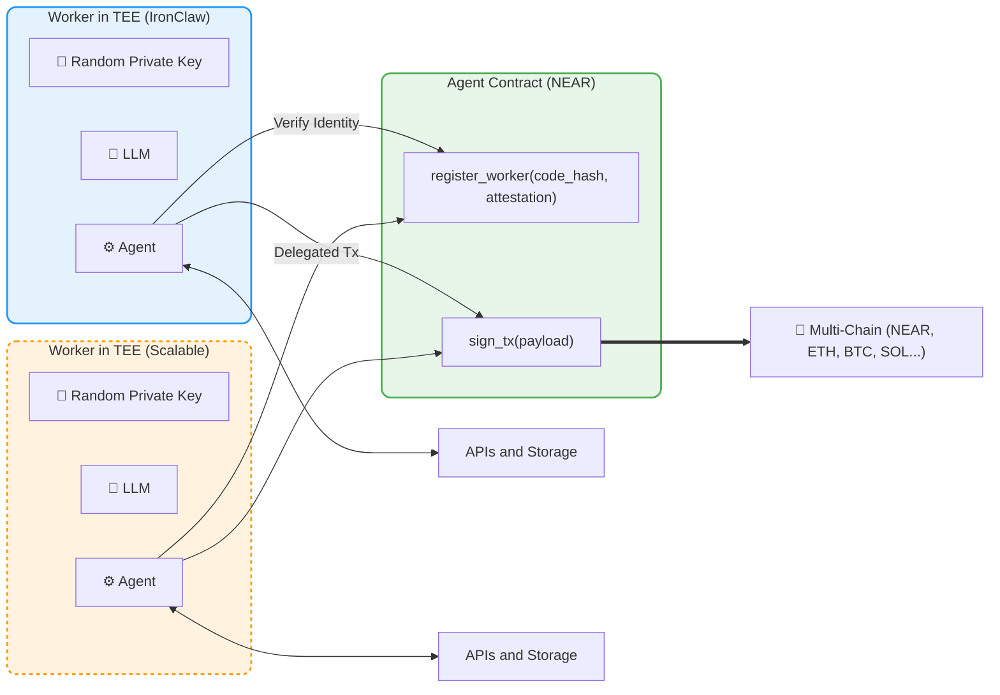

# 검증 가능한 실행 (Verifiable Execution) 및 체인 서명 아키텍처

---

본 문서는 NEAR 생태계의 **"검증 가능한 실행 (Verifiable Execution)"** 작동 방식과 다이어그램을 분석한 내용입니다. BUIDL-2026 해커톤 프로젝트의 TEE(IronClaw) 및 멀티체인 결제(Chain Signatures) 구조의 기술적 타당성을 증명하는 핵심 자료로 활용됩니다.

## 1. Worker in TEE (신뢰 실행 환경 내의 워커)
- **보안 격리:** 다이어그램 좌우측의 블록(`Worker in TEE`)은 호스트 OS나 외부 개입이 원천 차단된 하드웨어 기반의 안전한 실행 영역입니다. 프로젝트의 **IronClaw 런타임**에 해당합니다.
- **주요 컴포넌트 보호:** TEE 내부에서 추론을 담당하는 모델(`LLM`), 로직을 제어하는 에이전트(`Agent`), 그리고 파생되어 생성된 **개인키(`Random Private Key`)**가 절대 외부로 유출되지 않고 안전하게 보관 및 실행됩니다.
- **통신:** 하단의 `APIs and Storage`와 연결되어, 외부 서버 통신 간 발생할 수 있는 데이터 스니핑 위험 없이 암호화된 데이터를 불러오거나 전달합니다.

## 2. Agent Contract (온체인 에이전트 스마트 컨트랙트)
- **`register_worker(code_hash, attestation)`:** TEE 내부의 워커는 자신이 해킹되거나 조작되지 않은 "원본 에이전트 코드(code_hash)"를 정상 가동 중이라는 하드웨어 암호학적 보증서(Attestation)를 스마트 컨트랙트에 등록합니다. 이 과정을 거침으로써, 사용자는 AI 에이전트가 오직 지정된 조건(예: 데이터 소각, 기밀 보장 등)대로만 행동한다는 것을 수학적으로 신뢰(Verifiable)할 수 있습니다.
- **`sign_tx(payload)`:** AI 에이전트가 로직 수행 완료 후 특정 작업(예: 결제, 트랜잭션 브로드캐스트)을 외부 체인으로 내보내기 위해 중앙 컨트랙트에 서명을 요청하는 라우팅 함수입니다.

## 3. 멀티체인 상호작용 (Multi-Chain Outreach)
- 에이전트가 하나의 스마트 컨트랙트(`sign_tx`)를 호출하게 되면, 별도의 브릿지 설정이나 개별 지갑 없이 직접 다른 체인의 작업을 지시할 수 있습니다.
- 다이어그램 하단에 명시된 **NEAR, 이더리움(ETH), 일드길드게임즈(YGG), 비트코인(BTC), 솔라나(SOL)** 등 모든 레이어1 및 레이어2 생태계 대상 자산을 AI 에이전트 단독으로 관리 및 제어할 수 있게 됩니다.
- 이는 프로젝트 로드맵 상 구현된 **"단일 NEAR 기반 프라이빗 결제 및 체인 확장성 향상"**(Chain Signatures 플로우)을 그대로 대변합니다.

## 프로젝트 적용점 (Pitch Deck 연계 시사점)
본 기술 구조는 **"유전자 정보와 같은 초민감 프라이버시 데이터를 다루는 AI가 어떻게 코드를 안전하게 실행(TEE)하고, 수집된 데이터를 자율적으로 통제하면서 타 블록체인 생태계와 기밀 거래를 수행(Chain Signatures)할 수 있는가"**에 대한 완벽한 기술적 해답을 제공합니다. 피치덱 작성 시 프라이버시 인슈어런스 시스템의 핵심 아키텍처 다이어그램으로 차용할 수 있습니다.
