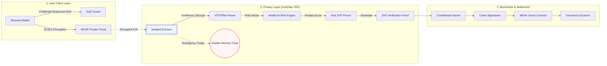

# 00_SYSTEM_ARCHITECTURE
> Created: 2026-04-12 22:06
> Last Updated: 2026-04-12 22:06

## 1. 아키텍처 개요 (Architecture Overview)
OHmyDNA 시스템은 사용자의 민감한 유전자 데이터를 보호하면서도 AI 기반의 맞춤형 보험 서비스를 제공하기 위해 **'3-Layer Privacy-Preserving Architecture'**를 채택합니다. 모든 데이터는 사용자 주권 하에 관리되며, 분석은 격리된 실행 환경(TEE)에서 수행되고, 결과는 영지식 증명(ZKP)을 통해 검증됩니다.

### 1.1 전체 시스템 다이어그램 (System Flow)

---

## 2. 레이어별 상세 정의 (Layer Details)

### 2.1 User Client Layer (Sovereignty)
- **Role**: 데이터 주권의 시작점이자 소유권 행사 레이어.
- **Core Protocols**:
    - **NEAR Wallet Selector**: NEP-413 기반의 Challenge-Response 인증을 통해 서버 세션 보안 확보.
    - **Client-side Encryption**: 데이터 업로드 전 브라우저 수준에서 ECIES(X25519 + AES-GCM) 암호화 수행.
    - **NPC (NEAR Private Cloud)**: 암호화된 Blobs의 중앙 집중식이 아닌, 사용자 전용 스토리지 공간.

### 2.2 Privacy Layer (IronClaw TEE)
- **Role**: 원본 데이터가 노출되지 않는 상태에서 연산이 이루어지는 'Black Box' 연산 레이어.
- **Security Features**:
    - **Isolated Enclave**: 하드웨어 수준에서 격리된 RAM 내에서만 데이터 복호화 및 분석 수행.
    - **Health AI Risk Engine**: 유전자 변이(SNP) 패턴을 분석하여 개인의 질병 위험도를 산출하되, 결과값은 TEE 외부로 유출되지 않음.
    - **Emergency Purge**: 분석 프로세스 완료 시 혹은 예외 발생 시 모든 휘발성 메모리(Raw DNA, Decrypted Data)를 즉각 소거.

### 2.3 Blockchain & Settlement Layer
- **Role**: 신뢰할 수 있는 결과 검증 및 프라이빗 자금 정산.
- **Tech Stack**:
    - **Noir ZKP**: 리스크 수치를 공개하지 않고 "보험 가입 기준 충족" 여부만을 증명하는 Proof 생성.
    - **Confidential Intents**: 트랜잭션의 상세 내용을 퍼블릭 멤풀에 노출하지 않는 기밀 거래 처리.
    - **Chain Signatures (MPC)**: 타 체인(ETH, SOL 등) 지갑 없이도 멀티체인 보험료 정산 지원.

---

## 3. 데이터 상태 전이 (Data State Transitions)
시스템 내에서 유전자 데이터는 아래와 같은 엄격한 단계를 거쳐 생명주기가 관리됩니다.

1. **Pending**: 사용자 지갑 인증 대기.
2. **Uploading**: 암호화된 데이터의 NPC 전송.
3. **TEE_Processing**: TEE 내부 로드 및 AI 연산 수행.
4. **ZKP_Generating**: 연산 결과를 바탕으로 영지식 증명 생성.
5. **Purged**: 원본 및 중간 데이터 영구 소멸 (분증/정산 완료).

---

## 4. 글로벌 루브릭 정렬 (Rubric Alignment)

*   **Functionality**: E2E 데이터 주권 보장 및 TEE-ZKP 하이브리드 아키텍처 구현.
*   **Potential Impact**: 데이터 유출 우려로 성장이 저해된 DTC 유전자 분석 시장의 신뢰 기반 인프라 제공.
*   **Novelty**: 단순한 데이터 보관(Storage)을 넘어, 프라이버시가 보장된 상태에서의 **분석(Compute)**을 결합한 최초의 NEAR 기반 AI 보험 에이전트.
*   **UX**: 복잡한 암호화 과정을 백그라운드에서 처리하고, 유저는 400ms 이내의 빠른 분석 리포트 체감.
*   **Business Plan**: 보험사로부터의 리드 생성 수수료 및 사용자 구독 기반의 건강 관리 모델.

---

## 5. Related Documents
- **Technical_Specs**: [DB_SCHEMA](./DB_SCHEMA.md) - 메타데이터 및 세션 데이터 구조
- **Technical_Specs**: [NEAR_PRIVACY_STACK_ARCH](./NEAR_PRIVACY_STACK_ARCH.md) - NEAR AI 프라이버시 스택 상세 구현
- **Technical_Specs**: [FILE_UPLOAD_FLOW](./FILE_UPLOAD_FLOW.md) - 클라이언트 측 암호화 및 업로드 상세
- **Logic_Progress**: [00_ROADMAP](../04_Logic_Progress/00_ROADMAP.md) - 단계별 아키텍처 구현 로드맵
