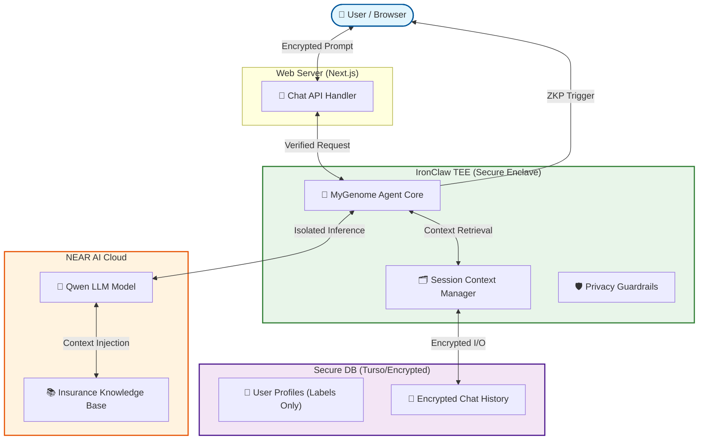

# [기술 명세] The Secret Keeper 서비스 아키텍처 (NEAR AI 기반)

- **작성일**: 2026-04-14
- **최종 수정일**: 2026-04-14
- **레이어**: 03_Technical_Specs
- **상태**: Draft v1.0

---

## 1. 개요 (Overview)

**The Secret Keeper** (코드명: MyGenome Agent)는 OHmyDNA 프로젝트의 지능형 핵심 레이어입니다. 사용자의 민감한 유전자 데이터를 보호하면서도, NEAR AI Cloud의 연산 능력을 활용하여 초개인화된 건강 및 금융(보험) 상담을 제공합니다. 

본 아키텍처의 핵심은 **"데이터를 노출하지 않고 지능을 빌려온다"**는 프라이버시 퍼스트 원칙에 있습니다. 모든 대화와 추론은 **IronClaw TEE (Intel TDX)** 환경 내에서 수행되며, 하드웨어 수준에서 암호학적으로 보호됩니다.

---

## 2. 시스템 아키텍처 (System Architecture)

### 2-1. 하이브리드 TEE-Cloud 구조

---

## 3. 핵심 데이터 플로우 (Data Workflow)

### 3-1. 대화 및 추론 프로세스 (Inference Workflow)

1.  **Prompt Entry**: 사용자가 질문을 입력합니다. (예: "내 위암 위험도가 높은데, 이를 보장하는 특약이 포함된 보험을 알려줘.")
2.  **Context Loading**: TEE 내부의 `AgentCore`가 사용자의 유전자 분석 결과(`riskProfile`) 및 기존 대화 이력을 로드합니다. 이때 원본 DNA 시퀀스가 아닌, 라벨링된 위험 지표만을 사용합니다.
3.  **RAG (Retrieval-Augmented Generation)**: 보험 상품 DB에서 해당 위험도에 특화된 상품 정보를 검색하여 LLM 프롬프트에 주입합니다.
4.  **Isolated Inference**: NEAR AI Cloud의 Qwen 모델을 사용하여 답변을 생성합니다. 모든 입력/출력 데이터는 인클레이브 내부에서 암호화된 상태로 통신합니다.
5.  **Privacy Scrubbing**: 답변 생성 직후, `GuardRail` 모듈이 답변 내에 혹시라도 포함될 수 있는 민감한 원본 수치나 개인정보를 필터링합니다.

### 3-2. TEE 증명 및 인증 (Attestation)

*   사용자는 매 대화 시점마다 **Intel TDX Attestation 배지**를 통해 현재 채팅 에이전트가 변조되지 않은 보안 구역(Enclave)에서 동작 중임을 시각적으로 확인합니다.
*   에이전트 응답에는 하드웨어 서명(Attestation Report)이 포함되어 응답의 무결성을 보장합니다.

---

## 4. 프라이버시 및 보안 명세 (Privacy & Security Specs)

### 4-1. 데이터 격리 정책 (Data Isolation)

*   **Zero-Copy Memory**: 유전자 분석 결과는 대화 세션 동안에만 TEE 메모리에 상주하며, 세션 종료 시 즉시 소각됩니다.
*   **Encrypted History**: 대화 이력은 사용자의 NEAR Wallet 개인키로 암호화되어 DB에 저장됩니다. 서버 관리자는 대화 내용을 읽을 수 없습니다.

### 4-2. NEAR AI SDK 연동 스펙

*   **SDK**: `openai` npm 패키지 (OpenAI 호환 API) 활용.
*   **Base URL**: `https://cloud-api.near.ai/v1`
*   **Model**: `Qwen/Qwen3-30B-A3B-Instruct-2507` (혹은 최신 추천 모델)
*   **Auth**: NEAR AI Cloud API Key를 TEE 환경 변수로 관리.

---

## 5. 단계별 구현 로드맵 (Roadmap)

### Phase 2-A: Foundation (Q3 2026)
*   TEE 내 에이전트 전용 런타임 구축.
*   기존 `riskProfile`을 프롬프트 컨텍스트로 자동 주입하는 로직 구현.
*   기본적인 일문일답(Stateless) 시스템 완성.

### Phase 2-B: Knowledge Base (Q3 2026)
*   보험 약관 및 웰니스 가이드를 위한 Vector DB(RAG) 구축.
*   NEAR AI Cloud 지식 기반 에이전트 연동.
*   복합 질문(Multi-hop reasoning) 처리 능력 강화.

### Phase 2-C: Advanced Features (Q4 2026)
*   능동형 알림(Proactive Notification) 시스템: 사용자의 데이터 변화나 보험 시장 변화 감지 시 선제적 상담 제안.
*   Confidential Intents와 연동하여 상담 중 즉시 보험 가입/결제 지원.

---

## 6. 관련 문서 (Related Documents)

- **Concept_Design**: [비즈니스 기획안](../01_Concept_Design/GENETIC_AI_INSURANCE_AGENT.md)
- **Technical_Specs**: [TEE Attestation 명세](./TEE_ATTESTATION_SPEC.md)
- **Technical_Specs**: [NEAR 기술 스택](./LATEST_NEAR_TECH_STACK.md)
- **Logic_Progress**: [마일스톤 로드맵](../04_Logic_Progress/ROADMAP.md)
